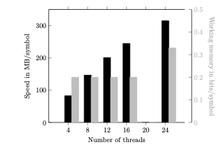

# LCG : Efficient terabyte-scale text compression

This repository contains the implementation of **LCG**, a highly parallelizable text compressor  
that scales efficiently to terabyte-sized inputs. Our method builds on locally consistent  
grammars, a lightweight form of compression, combined with simple recompression techniques to  achieve further space reductions.

## How does it work?

Locally consistent grammars are a simple form of compression that achieves significant space reductions. They are  suitable for large-scale inputs as they need minimal global information about the text, unlike Lempel-Ziv,  for instance. The main idea behind locally consistent grammars is to process matching substrings largely in the same way.  We built on this idea but added something new: stable local consistency. Put simply, the stable feature means that  
matching patterns occurring in multiple texts $T_1,T_2,...,T_x$ will be processed largely in the same way in the independent instances $COMP(T_1), COMP(T_2),\ldots,COMP(T_x)$ of the algorithm $COMP$ that compresses those texts. A merge phase afterwards occurs  where the different threads running $COMP$ collapse their outputs in one single representation of the collection  $\{T_1,T_2,...,T_y\}$. However, this step is relatively simple due to the locally consistent property and the fact  that the outputs are small compared to the plain text.

The different $COMP$ instances share satellite data during the compression. This data keeps the RAM  usage stable as we increase the threads. Nevertheless, the threads never write directly into the shared data, they only read it, thus avoiding contention.

Overall, our scheme allows us to compress a text collection in parallel and obtain a result equivalent to the one  we would get with the compression of all the strings with one instance.

After producing the locally consistent grammar in parallel, we run-length compress it, and finally we simplify it.  We **do not** apply any kind of statistical compression (yet).

# Third-party libraries

1. [xxHash](https://github.com/Cyan4973/xxHash)
2. [CLI11](https://github.com/CLIUtils/CLI11)

# Prerequisites

1. C++ >= 17
2. CMake >= 3.7

The xxHash and CLI11 libraries are already included in the source files of this repository.

# Installation

Clone repository, enter the project folder and execute the following commands:

```  
mkdir build  
cd build  
cmake ..  
make  
```  

# Input files

Our tool currently assumes the input is a concatenated collection of one or more strings, where every string ends with  the same separator symbol. The tool assumes the last symbol in the file is the separator.

For collections of ASCII characters (i.e, regular text, DNA, protein, etc), inputs in one-string-per-line format should work just fine.

# Compressing text

A basic running example:

```  
./lcg cmp sample_file.txt -t 4  
```  
The parameter `-t 4` indicates the number of threads to compress the text.

# Parameters

For the moment, these are the options we support:

```  
Usage: ./lcg cmp [OPTIONS] TEXT  
  TEXT                     Input file in one-string-per-line format
  -h,--help                Print this help message and exit
  -o,--output-file         Output file
  -t,--threads             Maximum number of parsing threads
  -q,--skip-simp           Do not simplify the grammar
  -e,--skip-rl             Do not perform run-length compression
  -r,--random-support      Add random access support for the grammar
  -g,--check-gram          Check that the grammar was compressed correctly
  -f,--fraction            The parsing threads will try to use at most this input fraction
  -c,--chunk-size          Size in bytes of each text chunk (def. min(TEXT_SIZE*0.005, 200MB))
```

`--skip-simp` will skip the simplification of the grammar. Skipping the simplification will increase space usage, but  it is convenient if one needs to add some structure to the output grammar.

`--skip-rl` will skip the run-length compression of the grammar. Like `--skip-simp`, it increases space usage but it  is convenient to operate over the strings.

`--check-gram` will check that the output grammar generates exactly the strings in the input. This step is optional and   mostly for debugging purposes.

`--fraction` indicates that the combined space of the text chunks plus the satellite data should not exceed this  fraction of the input. This parameter is only **a request**, and it could use more space if, for instance, the compressed  representation of the input exceeds this limit.

`--chunk-size` tells the program the approximate size of the text chunks processed in parallel by the threads.

# Random access support

For the moment, we offer inefficient random access support to the compressed text. It is inefficient because it needs  to load the full compressed text on RAM to access the query area. We can do much better in practice, but we must  implement it. However, the cost of random access is still logarithmic on the text size once the grammar is loaded.

Here is an example:

Compress with random access support:

```  
./lcg cmp sample_file.txt -r -o sample_file.lcg  
```  

Now you can query the area $T_x[7-25]$ (zero-based indexes) of the xth string in `sample_file.txt` as follows:

```  
./lcg acc sample_file.lcg i:7-25
```  

# Performance

## Competitor tools

- [zstd](https://github.com/facebook/zstd): A tool using a simplified version of LZ that encodes the output using Huffman and ANS. It is fast and achieves high compression ratios in practice.

- [agc](https://github.com/refresh-bio/agc): A compressor tailored for highly similar genomic sequences by Deorowicz et al. It breaks strings into segments and groups them into blocks based on sequence similarity, with each block compressed using `zstd`.

- [RePair](https://users.dcc.uchile.cl/~gnavarro/software/repair.tgz): A popular grammar compression algorithm by Larsson and Moffat, which recursively replaces the most common symbol pair in the text.

- [BigRePair](https://gitlab.com/manzai/bigrepair): A variant of RePair by Gagie et al. that scales the compression of large datasets using prefix-free parsing.

## Input datasets

We considered four massive string collections for the experiments.

- **HUMANS**: all the human genome assemblies available in [NCBI](https://www.ncbi.nlm.nih.gov/datasets/genome/?taxon=9606) up to **August 27, 2024**. This collection has 1,270 assemblies and is 3.46 TB in size.
- **ATB**: release 2.0 of the AllTheBacteria dataset from Hunt et al.. It contains 1,932,812 curated genome assemblies from different bacteria and archaea.
- **ECOLI**: a subset of **ATB** with 8,000 assemblies of the E. coli genome, totalling 40.57 GB.
- **COVID**: all the assemblies available in NCBI for SARS-CoV-2 up to **November 5, 2024**. This collection has 8,989,016 genomes and a size of 267.39 GB.

The datasets were in FASTA format, and we preprocessed them as follows: we set all the characters to uppercase, removed  new lines inside the strings, and stored the sequences in one-string-per-line format. The tool **agc** requires the input  to be in FASTA format, so we created copies of the preprocessed datasets containing small FASTA headers. We only used  these copies with **agc**. The table shows more information about the datasets.

| Dataset | Alphabet | Number of strings | Shortest string | Longest string | Size      |     |
| ------- | -------- | ----------------- | --------------- | -------------- | --------- | --- |
| ATB     | 5        | 318,727,183       | 200             | 5,204,208      | 7.86 TB   |     |
| HUM     | 15       | 17,967,001        | 24              | 924,591,359    | 3.46 TB   |     |
| COVID   | 15       | 8,989,016         | 19              | 30,643         | 267.39 GB |     |
| ECOLI   | 5        | 2,024,396         | 200             | 1,657,328      | 40.57  GB |     |

## Setup

The tools **LCG**, **agc**, **zstd**, and **BigRePair** support multithreading, so we used 16 threads in each. **RePair**  does not support multithreading, and due to time constraints, we did not run the other tools with one thread.  For **zstd**, we used compression level 15 and a window size of 2 GiB. The tool does not allow longer windows with  compression level >=15.

We did not test **HUM** and **ATB** with **RePair** the resource consumption would have exceeded the capacities of  our machine. Further, **BigRePair** crashed with **HUM** and **ATB** due to a hash collision error. Finally, we did not run  **agc** with **ATB** due to time constraints.

We conducted the experiments on a machine with AlmaLinux 8.4, 3 TiB of RAM, and processor Intel(R) Xeon(R) CPU E7-8890 v4 @ 2.20GHz, with 192 cores.

## Results
### Compression ratio (plain/compressed)

| Tool      | ATB       | HUMANS     | COVID      | ECOLI      |  
|-----------|-----------|------------|------------|------------|  
| LCG       | **85.26** | 135.54     | 328.10     | 104.33     |  
| agc       | -         | **144.90** | 237.93     | 34.74      |  
| zstd      | 58.19     | 4.72       | 344.99     | 90.11      |  
| RePair    | -         | -          | **778.62** | **166.76** |  
| BigRePair | -         | -          | 586.12     | 128.71     |  

### Speed (MB/seconds)

| Tool      | ATB        | humans     | covid      | ecoli      |  
|-----------|------------|------------|------------|------------|  
| LCG       | **232.26** | **244.73** | **506.44** | **270.88** |  
| agc       | -          | 120.42     | 53.71      | 13.58      |  
| zstd      | 95.51      | 27.21      | 442.79     | 104.63     |  
| RePair    | -          | -          | 1.89       | 2.85       |  
| BigRepair | -          | -          | 47.89      | 22.84      |  

### Working memory (bits/input symbol)

| Tool      | ATB       | humans   | covid    | ecoli    |  
|-----------|-----------|----------|----------|----------|  
| LCG       | 0.43      | 0.29     | 0.36     | 2.04     |  
| agc       | -         | 0.15     | 0.18     | 1.41     |  
| zstd      | **0.004** | **0.01** | **0.10** | **0.69** |  
| RePair    | -         | -        | 30.63    | 99.92    |  
| BigRepair | -         | -        | 2.28     | 5.90     |  

## Effectiveness of multithreading

We also assessed the effectiveness of our parallel functionality. For that purpose, we ran **LCG** with **HUM** varying  the number of threads from four to 24. The figure below shows that the running time increases steadily as we add more  threads, with an stable memory peak up to 16 threads.



# Further work

We plan to support the following features in the near future:

- Semi external mode for situations where the compression process uses considerable working memory.  
  For instance, terabytes of no-so-repetitive data.
- A better algorithm for random access.
- Text edition in compressed space.
- Combine different compressed representation into one.  
  This functionality is already implemented but only to support parallel compression.
- Support for other text formats, like FASTA/Q.

# Bugs

This tool still contains experimental code, so you will probably find bugs. Please report them in this repository.

# How to cite

You can use this preprint for the moment:

```
@article{ddd24eff,
  title={Efficient terabyte-scale text compression via stable local consistency and parallel grammar processing},
  author={Diaz-Dominguez, Diego},
  journal={arXiv preprint arXiv:2411.12439},
  year={2024}
}
```

# Author

This implementation was written by [Diego Díaz](https://github.com/ddiazdom) .